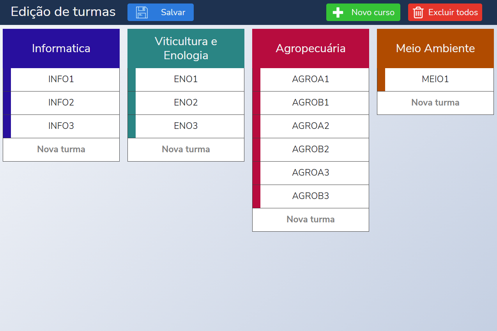
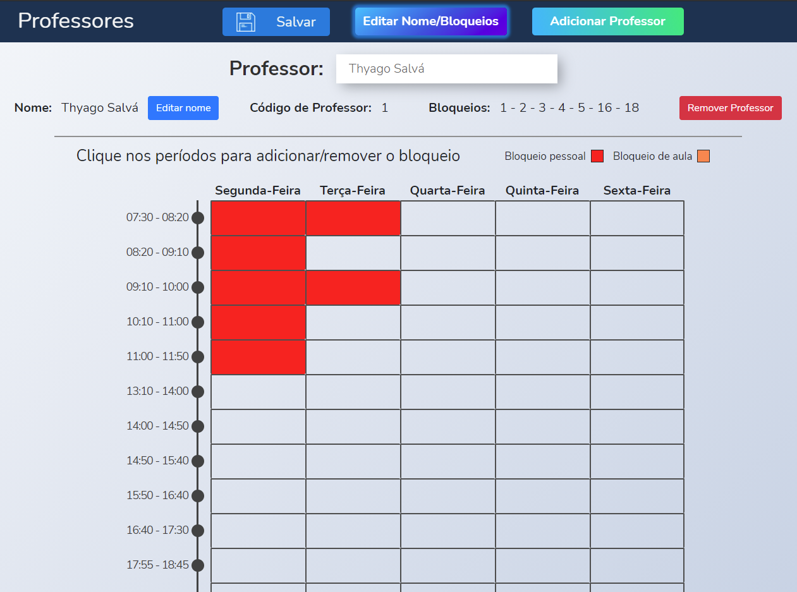
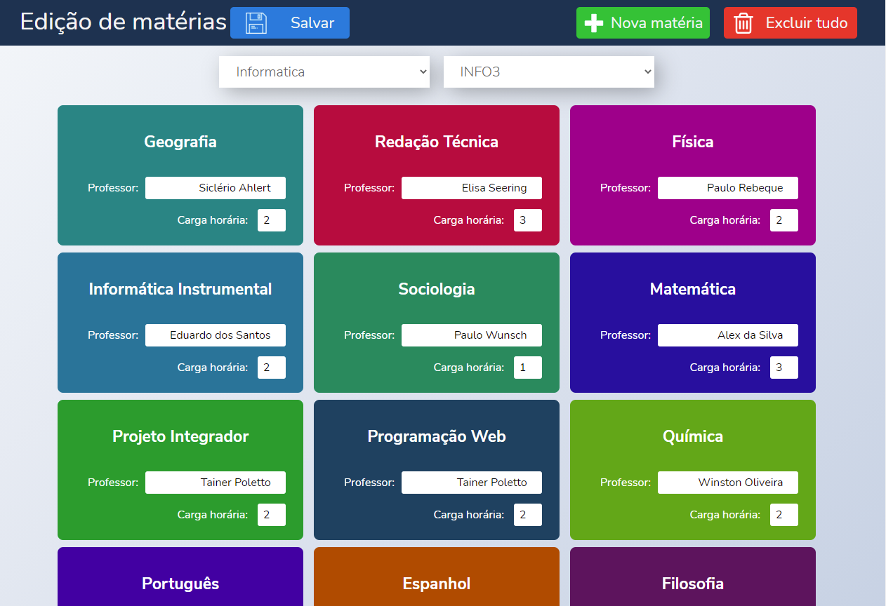
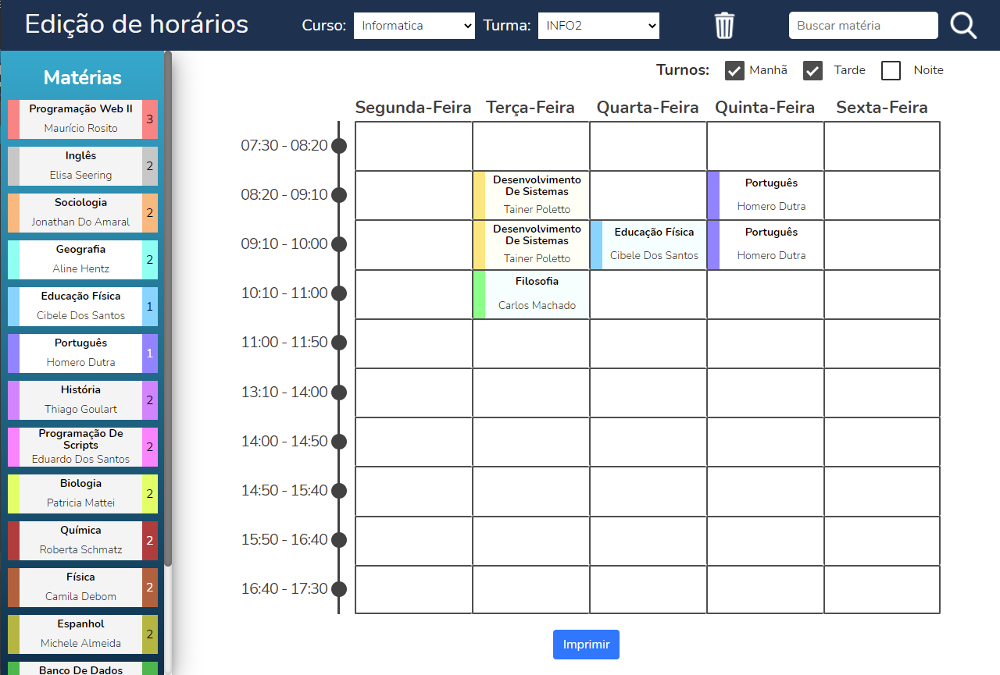

# Show time
**A complete class manager for educational institutions**

</img> 
</img> 
</img> 
</img>

## Features
* Manage class and teacher schedules
* Add, change or remove **courses, classes, subjects and teachers**
* Assign and manage subjects to school periods
* Add busy periods for teachers through CSV files
* Print timetable for each class

_**Project made during study period in IFRS**_
